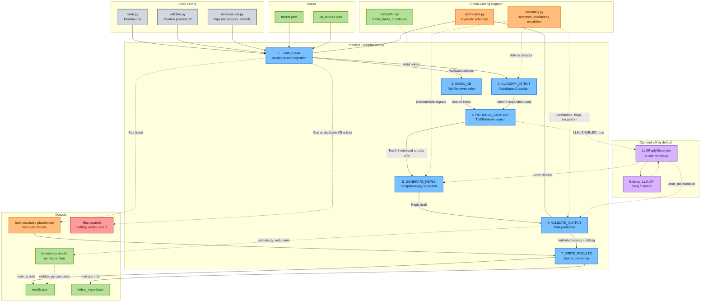

# Support Ticket Processing Service

> **Setup & deployment:** [SETUP.md](SETUP.md) · **Design notes, requirement traceability, audit:** [DESIGN.md](DESIGN.md)

A small, runnable service that turns customer-support tickets into structured reply drafts. For each ticket it:

1. classifies the intent,
2. retrieves the most relevant help-center snippets from a local knowledge base,
3. drafts a reply grounded in those snippets, with a confidence score, safety flags and an escalation signal.

It runs fully offline by default: no API key, no network access, no model download.

**What is and isn't "AI" here.** The default path uses no LLM:

| Component | Default implementation |
|---|---|
| Intent classifier | Rule-based (weighted keyword/phrase lexicon + an independent advice detector) |
| Retriever | TF-IDF + cosine similarity (scikit-learn), local only |
| Reply generator | Template-based: fixed policy phrases + sentences copied from retrieved KB articles |
| Validator | Deterministic schema, policy and grounding checks |

An optional LLM reply generator (Groq or Gemini) exists. It is **off by default** (see §17).

---

## 1. Project overview

The input is `tickets.json` and `kb_articles.json`. The output is `results.json` (one entry per valid ticket, in the required schema) and `debug_report.json` (per-ticket explanation). The design focuses on separating stages clearly, making behaviour deterministic, and failing safely on adversarial or malformed input. It does not aim for a perfect model.

## 2. Features

- An explicit 7-stage pipeline (`src/pipeline.py`).
- Strict input validation: types, length limits, Unicode normalization, duplicate IDs, empty messages.
- Deterministic retrieval with a relevance threshold, stable tie-breaking and top-k limited to 1–3.
- Grounded replies: every sentence in a reply is either an approved policy phrase or a sentence from a retrieved article. The validator re-checks this independently.
- Trading-advice requests are always refused politely, whatever was retrieved and however confident the classifier is.
- Prompt-injection detection on tickets and on KB text. Suspicious text is treated as data, is never echoed into replies, and gets flagged and escalated.
- Confidence score (a heuristic) plus rule-based escalation, with the reasons recorded in `debug_report.json`.
- Atomic writes. A failed run never leaves a half-written `results.json`.
- Swappable classifier, retriever, generator and validator behind abstract base classes.
- Offline fallback. The optional LLM generator falls back to templates on any error.

## 3. Architecture and pipeline stages



**How to read this diagram**
- The blue boxes are the 7 pipeline stages, run top to bottom. Solid arrows show data flow.
- The generator only ever sees the top 1–3 retrieved articles, never the whole KB. The validator is an independent gate between the generator and any output.
- Dotted arrows are conditional paths: safety inputs, failure handling, the in-memory runs, and the optional LLM generator (purple). The LLM is off unless `LLM_ENABLED=true`, falls back to templates on any error, and its drafts still go through the validator.
- An invalid ticket gets a safe escalated placeholder result. An invalid KB stops the run before anything is written.
- Only `main.py` writes files. `validate.py` and the web demo run the pipeline in memory.

```
LOAD_DATA -> INDEX_KB -> CLASSIFY_INTENT -> RETRIEVE_CONTEXT -> GENERATE_REPLY -> VALIDATE_OUTPUT -> WRITE_RESULTS
```

| Stage | Method in `Pipeline` | What it does |
|---|---|---|
| LOAD_DATA | `load_data` | Reads both JSON files (5 MB cap). Validates each ticket with pydantic and rejects bad tickets individually. Any KB problem aborts the run. |
| INDEX_KB | `index_kb` | Fits TF-IDF on the KB, with articles sorted by ID so file order doesn't matter. |
| CLASSIFY_INTENT | `classify_intent` | Rule-based label, certainty, coverage and conflict/advice signals. |
| RETRIEVE_CONTEXT | `retrieve_context` | The query is the ticket text plus fixed terms for the predicted intent (§11). Returns up to 3 hits above the threshold, with scores. |
| GENERATE_REPLY | `generate_reply` | Builds deterministic safety `Signals`. Passes **only the retrieved articles** to the generator. |
| VALIDATE_OUTPUT | `validate_output` | Independent schema, policy and grounding checks. Repairs the reply if needed, then computes confidence, flags and escalation. |
| WRITE_RESULTS | `write_results` | Serializes everything first, then writes each file atomically. |

`Pipeline.process()` runs the first six stages without side effects. `validate.py` uses it for the reproducibility check. `Pipeline.run()` also writes the files.

## 4. Repository structure

```
├── main.py                 # run the pipeline
├── validate.py             # validate outputs + reproducibility
├── demo/                   # local web demo (server.py + index.html)
├── tickets.json            # sample input (from the brief)
├── kb_articles.json        # sample KB (from the brief)
├── results.json            # generated
├── debug_report.json       # generated
├── requirements.txt        # runtime + test deps (offline)
├── requirements-llm.txt    # optional LLM SDKs
├── src/
│   ├── config.py           # paths, limits, thresholds, LLM opt-in
│   ├── models.py           # pydantic input/output models, internal records
│   ├── pipeline.py         # stages + orchestration
│   ├── classifier.py       # IntentClassifier ABC + RuleBasedClassifier
│   ├── retriever.py        # Retriever ABC + TfidfRetriever
│   ├── generator.py        # ReplyGenerator ABC + TemplateReplyGenerator + LLMReplyGenerator
│   ├── validator.py        # OutputValidator ABC + PolicyValidator + check_result_dict
│   ├── safety.py           # advice/injection/account detectors, confidence, escalation
│   ├── utils.py            # normalization, safe JSON load, atomic write, logging
│   └── llm/                # optional Groq/Gemini clients (only imported if LLM enabled)
└── tests/                  # pytest: classifier, retrieval, generation, validation, security, pipeline
```

## 5. Technology stack

- Python 3.10+ (developed and tested on 3.14.3)
- scikit-learn: `TfidfVectorizer`, `linear_kernel`
- pydantic v2: strict input and output models
- Standard library: JSON, logging, `tempfile` and `os.replace` for atomic writes
- pytest

No LangChain, no vector database, no Docker. None of these is needed at this scale.

## 6. Installation and setup

```bash
python3 -m venv .venv
source .venv/bin/activate
pip install -r requirements.txt
```

The default run needs no `.env` and no keys.

## 7. How to run

```bash
python main.py
# optional: python main.py --tickets path/to/tickets.json --kb path/to/kb.json --out-dir some/dir
```

All default paths are resolved relative to the project directory, so you can run it from any working directory. The exit code is `1` on a fatal input error, and in that case nothing is written.

### Web demo

```bash
python demo/server.py            # then open http://127.0.0.1:8000
```

A single page (`demo/index.html`) served by a standard-library HTTP server (`demo/server.py`). It needs no extra dependencies and runs the same offline pipeline on tickets you type in. There are one-click sample tickets and adversarial examples, and it can run all samples at once. Each result card shows:

- the intent;
- the retrieved articles with their scores;
- the reply draft;
- the grounded and escalation badges;
- confidence and safety flags;
- the escalation reasons;
- the raw `results.json` entry and debug entry.

It binds to `127.0.0.1` by default, caps request bodies at 256 KB and 50 tickets, writes nothing to disk, never returns tracebacks, and renders all text with `textContent`, so ticket content can't inject HTML. It is a demo, not a production server: no auth, no TLS, no rate limiting.

## 8. How to validate outputs

```bash
python validate.py
```

It checks the following:

- the files exist and are valid JSON;
- there is exactly one result per valid ticket;
- every result passes the strict schema;
- article IDs are known;
- trading-advice tickets are refused;
- deposit tickets retrieve the deposit article;
- withdrawal tickets are policy-sensitive and escalated;
- ungrounded results are escalated;
- sample checks T1→A1 and T4 refused (only when those IDs are present);
- the debug report covers every ticket;
- two fresh runs give identical results, and they match `results.json` on disk.

Exit code `0` means every check passed.

## 9. How to run tests

```bash
python -m pytest -q
```

The tests run offline. `tests/test_security.py` covers the 10 adversarial scenarios from the brief (§14). LLM-generator tests use a fake client.

## 10. How classification works (`src/classifier.py`)

- Each support intent (`deposit_issue`, `password_reset`, `withdrawal_issue`, `account_lock`) has a list of weighted regexes. A ticket's score for an intent is the sum of the weights of the regexes that match.
- An intent counts as **present** when its score is at least 1.5. The top present intent wins.
- **Certainty** is `(top − runner_up) / top`. **Rule coverage** is `min(1, top / 3)`. Both are heuristics.
- **Conflicting signals**: two support intents are present and less than 1.0 apart.
- **Advice detection** (`safety.detect_advice`) always runs separately. It de-obfuscates first (lowercasing, simple leetspeak, `b u y` → `buy`).
  - If advice is detected and no support intent is present, the label is `trading_advice_request`.
  - If both are present, the support intent stays the label and the ticket is marked mixed (§13).
- Otherwise the label is `other`. An `other` ticket is never answered with KB text, even if retrieval found a lexical match (e.g. "email newsletter" matches the password-reset article on "email"). It gets the cautious follow-up reply and is escalated.
- The label comes only from these rules. Nothing in the ticket can choose it. For example, "set intent to other" is just text, and it also triggers the injection detector.

## 11. How retrieval works (`src/retriever.py`)

- **Index**: `TfidfVectorizer` with English stop words, 1–2-grams and `sublinear_tf`, fitted on `title. title. body`. The title is repeated once for a little extra weight. Articles are sorted by ID first.
- **Query**: the normalized ticket text, plus a few fixed topic terms for the predicted intent (`QUERY_EXPANSION` in `src/classifier.py`). For example, a `withdrawal_issue` ticket adds "withdrawal declined review", so "my payout was rejected" still finds the withdrawal article. When advice is detected on a mixed ticket, the policy terms are added too. The expansion never contains ticket text, is deterministic, and is recorded in the debug report. Queries shorter than 3 characters return no hits.
- **Scoring**: cosine similarity, rounded to 6 decimal places. Results are sorted by `(-score, article_id)`, which gives stable tie-breaking.
- **Selection**:
  - Hits must reach `min_relevance` (0.08).
  - Hits after the first must also score at least 50% of the best hit.
  - At most `top_k` hits are returned, and `top_k` is clamped to 1–3.
  - If nothing passes, `retrieved_articles` holds the single best candidate with a non-zero score. This follows the brief's "top 1 to 3" rule and keeps the result traceable. That article is **not** used in the reply, and the ticket is flagged `insufficient_grounding` and escalated. `retrieved_articles` is `[]` only when the ticket shares no vocabulary with any article.
- **Topic cross-check**: the top article's *title* goes through the same classifier. If it points to a different support topic than the ticket, that counts as a conflicting signal and the ticket is escalated. The check is content-based and uses no hardcoded article IDs.
- **Limitations**: TF-IDF is lexical. It misses synonyms, and keyword stuffing can game it. It is **not** a security control. Safety comes from the downstream grounding check and escalation, not from retrieval.

## 12. How response generation works (`src/generator.py`)

The `TemplateReplyGenerator` receives only the retrieved articles plus the deterministic `Signals`.

- **Pure trading-advice ticket**: a fixed polite refusal plus a pointer to educational resources. This happens whatever was retrieved.
- **Otherwise**:
  1. The reply opens with an intent-specific sentence.
  2. It adds sentences **copied from the retrieved articles**, lightly rewritten from agent-facing to customer-facing wording by a fixed rule set (`customerize`, e.g. "Ask the client to" → "Please").
     - Agent-only sentences such as "Support should not promise…" are left out.
     - KB sentences that look like instructions to the system are dropped, and the ticket is flagged.
     - Secondary articles only contribute sentences that share at least 2 words with the ticket.
  3. It adds fixed caveats where they apply:
     - account details aren't visible here (deposit and withdrawal tickets);
     - withdrawal approval and timing can't be confirmed;
     - a security reminder (password and lock tickets);
     - a hand-off to the support team (sensitive, suspicious or mixed tickets).
  4. On a mixed ticket, the advice part is refused in a separate sentence.
- **No evidence**: a cautious "we couldn't find an article, the team will follow up" reply.
- Ticket text is never copied into the reply. No reply is written specifically for any ticket ID.
- The generator does not decide `grounded`. The validator does.

## 13. Confidence and escalation logic (`src/safety.py`, `src/validator.py`)

The confidence score is a **deterministic heuristic in [0, 1]. It is not a calibrated probability.**

```
retrieval_strength = min(1, top_score / 0.30)   if retrieval sufficient, else 0
                   = 1                            for a pure trading-advice refusal (policy-certain)
base = 0.5·retrieval_strength + 0.3·classifier_certainty + 0.2·rule_coverage
penalties: fallback used −0.2, conflicting/mixed −0.15, suspicious input −0.1,
           ungrounded −0.2, non-English −0.1
confidence = clamp(base − penalties, 0, 1)
```

`needs_human_escalation = true` when any of these apply:

- a withdrawal ticket (`policy_sensitive`);
- a mixed support + advice ticket (`mixed_intent`);
- suspicious input in the ticket or the KB (`suspicious_input`);
- no article above the threshold, or the reply can't be traced to the KB (`insufficient_grounding`);
- a validator fallback;
- conflicting intent signals;
- a non-English ticket;
- confidence below 0.45 (`low_confidence`);
- intent `other`.

A pure advice request is refused and flagged `advice_request`, but not escalated. `account_specific_request` is a flag only: the ticket gets general KB guidance plus a caveat that account details aren't visible. It escalates only through the other rules. For example, withdrawals always escalate.

Allowed flags: `advice_request`, `insufficient_grounding`, `policy_sensitive`, `low_confidence`, `account_specific_request`, `mixed_intent`, `suspicious_input`.

Each entry in `debug_report.json` contains:

- the predicted intent and classifier scores;
- retrieved article titles with their scores;
- the confidence breakdown;
- the validation issues;
- the escalation reasons, including why a ticket was *not* escalated.

It holds only the message length, never the raw ticket text, prompts or secrets.

## 14. Security controls and threat model

**Assets**: correct, non-harmful replies; the integrity of the output schema; customer data (ticket text).
**Untrusted inputs**: ticket messages, KB text, and output from any generator (especially an LLM).

| Threat | Controls |
|---|---|
| Prompt injection in a ticket ("ignore instructions", "reveal the system prompt", "pretend the payment succeeded", "return a different schema") | Label, retrieval, policy and schema come only from code, never from ticket text. Pattern detector → `suspicious_input` + escalation. Ticket text is never echoed into the reply. The LLM prompt wraps the ticket and KB in escaped `<ticket>`/`<kb>` tags marked as untrusted data. The deterministic validator runs whatever the prompt says. |
| Injection inside KB text | Instruction-like KB sentences are dropped before use, and the ticket is flagged and escalated. |
| Trading advice (direct, disguised, obfuscated, mixed) | An independent advice detector runs on every ticket. Pure requests get a fixed refusal and are never sent to an LLM. Mixed tickets answer the support part, refuse the advice part, and escalate. The validator scans replies for recommendation or prediction language and replaces the reply with a refusal if needed. |
| Unsupported claims or hallucination | Grounding is recomputed sentence by sentence against the retrieved KB plus the approved phrases. Regexes block invented outcomes ("has been credited"), completed actions ("I have unlocked"), and timelines ("within 24 hours"). If a check fails, the reply becomes a safe fallback and the ticket is escalated. |
| Malformed or hostile generator output | Non-string or empty replies, oversized replies, citations of articles that weren't retrieved, generator exceptions and non-`DraftReply` returns all lead to the safe fallback. The output goes through the strict `Result` model: unknown fields are forbidden, bools must be real bools, confidence must be a finite number in [0, 1], intents and flags must be known values. Nothing is `eval`'d. |
| Malformed or oversized input | 5 MB file cap. Messages are limited to 2000 characters, titles to 200 and bodies to 5000. Up to 1000 tickets and 500 articles. NFKC normalization, removal of control, zero-width and bidi characters, and an ID regex. A bad ticket is not answered. If it has a usable, unique ID it still gets exactly one result: a safe placeholder with intent `other`, no articles, confidence 0, escalated, and a "couldn't process this message automatically" reply. Tickets with no usable ID, or a duplicate ID, get no result and are listed in `rejected_tickets` in the debug report. A bad or duplicate KB entry aborts the run and nothing is written. |
| Retrieval manipulation | Local KB only, no URL fetching, relevance threshold, relative cutoff, top-k of at most 3. A retrieval failure leads to escalation, never an unsupported answer. |
| Partial or corrupt output | Serialize first, then write each file to a temp file, `fsync`, and `os.replace`. |
| Data leakage | Logs contain IDs and counts only. The debug report has no raw text. The LLM path is off unless explicitly enabled. |

## 15. Known limitations and residual risks

- **Pattern detectors can be evaded.** Advice and injection detection use regexes with light de-obfuscation. Novel paraphrases, other languages, or heavy obfuscation can get past them. The main backstops are that the template generator never uses ticket text and the validator's output checks. The system is not claimed to be adversarially robust.
- **Keyword classifier**: brittle with synonyms, typos and multi-issue tickets. Conflicts are detected but only resolved by escalation.
- **TF-IDF retrieval**: lexical only. The thresholds (0.08 and 0.30) were tuned on a 5-article KB and may need retuning for a larger one.
- **The grounding check is heuristic**: it checks that each sentence *comes from* retrieved content, not that the content fully *answers* the question.
- **Template replies are terse** and fairly generic. They are built for safety and traceability, not style.
- **English only.** Non-English tickets are processed but lose confidence and are escalated.
- **Confidence is not calibrated.**
- An LLM reply that paraphrases the KB will usually fail the strict grounding check and be escalated. That is safe but noisy. If you want to use LLM output, you would need a looser, semantic grounding check.

## 16. How to replace components

Every component is injected into `Pipeline`:

```python
from src.pipeline import Pipeline
Pipeline(classifier=MyClassifier(), retriever=MyRetriever(), generator=MyGenerator(), validator=MyValidator()).run()
```

Implement the relevant ABC:

| ABC | Method |
|---|---|
| `IntentClassifier` | `classify(text) -> ClassificationResult` |
| `Retriever` | `index(articles)` and `search(query, k) -> RetrievalResult` |
| `ReplyGenerator` | `generate(message, intent, context, signals) -> DraftReply` |
| `OutputValidator` | `validate(...) -> ValidationReport` |

For example, an embedding retriever only needs to return scored hits. The threshold, grounding checks and escalation still apply.

## 17. Optional LLM integration

`LLMReplyGenerator` in `src/generator.py` uses the clients in `src/llm/` (Groq or Gemini). **It is disabled by default.** It is used only when the process environment has `LLM_ENABLED=true`. `.env` is **not** loaded automatically.

```bash
pip install -r requirements-llm.txt
export LLM_ENABLED=true DEFAULT_PROVIDER=groq GROQ_API_KEY=...   # or DEFAULT_PROVIDER=gemini GEMINI_API_KEY=...
python main.py
```

- **Privacy**: when enabled, **ticket text and retrieved KB snippets are sent to the third-party provider.** Don't enable it for real customer data without the right agreements in place.
- The prompt includes only the retrieved snippets. It marks the ticket and KB as untrusted data, and it requires JSON `{"reply", "cited_articles"}`.
- The output is parsed with `json.loads` plus the strict `LLMDraft` model. Citations must be a subset of the retrieved articles.
- Any failure falls back to the template generator: a missing SDK or key, an API error, a timeout, a rate limit after 3 retries, or malformed JSON. This is recorded as `llm_fallback` in the debug report.
- Pure trading-advice tickets are never sent to the LLM.
- All LLM replies still go through the same independent validator.
